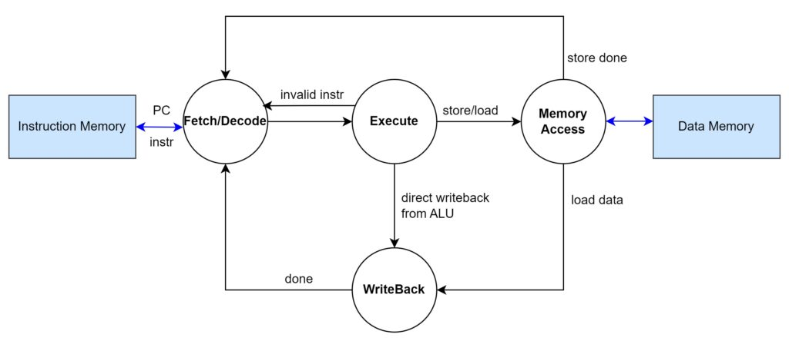
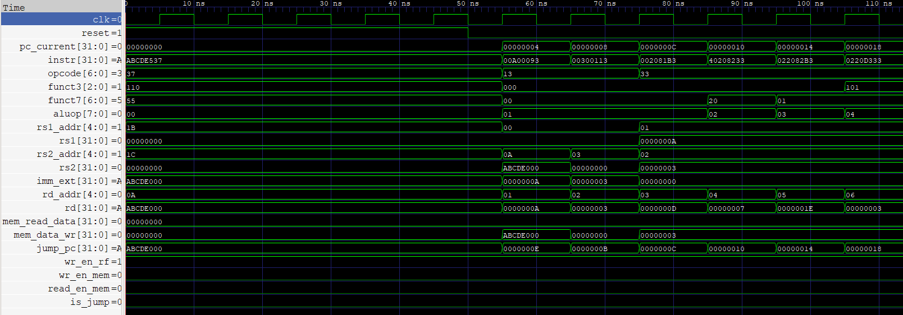

##  Introduction

**Sanganac** (Sanskrit for *Computer*) is a RISC-V based CPU core implemented in Verilog HDL. Adhering to the **RV32I** base integer along with the M-extension multiplication sets, this processor is designed for deterministic execution and architectural clarity. It serves as a clean, hardware-level foundation for understanding the RISC-V ecosystem.

---

## 📁 File Structure

```

├── assets/                 
│   ├── cycle.png           # Execution cycle state diagram
│   ├── sanganac.png        # Project logo
│   └── waveform.png        # GTKWave simulation waveform
├── rtl/                   
│   ├── alu.v               # Arithmetic Logic Unit
│   ├── control.v           # Control unit
│   ├── datamem.v           # Data Memory
│   ├── decoder.v           # Instruction Decoder & Immediate generation
│   ├── instrmem.v          # Instruction Memory
│   ├── pc.v                # Program Counter
│   ├── regfile.v           # Register File
│   ├── riscv_core.v        # RISCV CPU core
│   └── top.v               # Top Level Module
├── sim/                   
│   ├── data_mem.hex        # Initialized Data memory
│   ├── instr_program.hex   # Instruction Program in Hexadecimal format
│   ├── sanganac.vvp        # Compiled Icarus Verilog binary executable
│   └── tb.vcd              # Value Change Dump for waveform analysis
├── tb/                     
│   └── tb.v                # Comprehensive System Testbench
├── LICENSE                 # License (MIT)
└── README.md               # Project documentation

```

## 🏗️ Architecture

### Datapath Implementation

Sanganac is a modular RISC-V implementation where the instruction lifecycle—from fetch to write-back—is managed through a synchronized datapath. The control logic is purely combinational, deriving enable signals and ALU opcodes directly from the instruction word to drive the execution and memory stages.

### Design Specifications

* **64-bit ALU Intermediate Bus:** The ALU architecture maintains a 64-bit internal result path to support the **M-extension**. This allows for the capture of the upper 32 bits during multiplication (`MULH`), which are subsequently routed back to the destination register based on the `funct3` field.
* **Sub-word Memory Alignment:** Data memory (`datamem.v`) uses a 4-bit byte-lane masking through `mem_mask`. This hardware allows the core to execute `SB` and `SH` instructions by targeting specific byte offsets within a 32-bit word.

---

### 🗒️ Instruction Set

Sanganac provides a RISCV based instruction set, implementing the RV32I specification along with the M-Extension.

#### **Integer (I) Extension** 

The core handles base integer operations across all standard RISC-V instruction formats implemented in your `decoder.v` and `control.v`:

* **R-Type (Register-to-Register):**
* `ADD`, `SUB`: Addition and Subtraction logic.
* `SLL`, `SRL`, `SRA`: Logical Left/Right and Arithmetic Right Shifts.
* `XOR`, `OR`, `AND`: Bitwise logical operations.


* **I-Type (Immediate & Loads):**
* `ADDI`, `ANDI`, `ORI`, `XORI`: Arithmetic and logical operations using 12-bit sign-extended constants.
* `SLLI`, `SRLI`, `SRAI`: Shift operations using immediate values.
* `LB`, `LH`, `LW`: Load Byte, Half-word, and Word.


* **S-Type (Stores):**
* `SB`, `SH`, `SW`: Store Byte, Half-word, and Word.


* **B-Type (Conditional Branches):**
* `BEQ`, `BNE`: Branch if Equal or Not Equal. These calculate the `jump_pc` and trigger the `is_jump` signal to update the Program Counter.


* **U-Type (Upper Immediates):**
* `LUI`: Load Upper Immediate (sets the top 20 bits of a register).
* `AUIPC`: Add Upper Immediate to PC (used for position-independent addressing).


* **J-Type (Unconditional Jumps):**
* `JAL`: Jump and Link. Performs an unconditional relative jump and stores the return address in the destination register.


* **Multiplication:**
* `MUL`: Returns the lower 32 bits of the product.
* `MULH`: Returns the upper 32 bits of a signed multiplication, utilizing the ALU's internal 64-bit output bus.


* **Division & Remainder:**
* `DIV`: Signed integer division.
* `REM`: Signed remainder (modulo) operation.

---

## 🔄 Execution Cycle

### 1. Instruction Fetch (IF) 

The **PC** module provides the current address to the **INSTRMEM**. The 32-bit instruction is fetched and delivered to the decoder.

* **Key Signal:** `pc_current`  `instr`

### 2. Decode & Immediate Generation (ID) 

The **DECODER** splits the instruction into fields (`rs1`, `rs2`, `rd`, `opcode`, `funct3`, `funct7`). Simultaneously, the Immediate Generator reshuffles the bits to produce a sign-extended 32-bit `imm_ext`.

* **Key Signal:** `instr`  `opcode`, `funct3`, `funct7`, `rs1_addr`, `rs2_addr`, `imm_ext`

### 3. Register Read & Control (EX) 

The **CONTROL_UNIT** evaluates the opcode to set enable signals. The **REGFILE** outputs the data for `rs1` and `rs2`. If the instruction is a branch, the jump logic determines if `is_jump` should be asserted.

* **Key Signal:** `rs1_addr`/`rs2_addr`  `rs1`/`rs2`

### 4. Execute (ALU) 

The **ALU** performs the arithmetic or logical operation based on the `aluop`. For **M-extension** instructions, it calculates the product or quotient. For memory instructions, it calculates the effective address.

* **Key Signal:** `alu_in1`, `alu_in2`  `alu_output`

### 5. Memory & Write-Back (MEM/WB) 

If the instruction is a Load or Store, the **DATAMEM** is accessed using the `alu_output` as the address. Finally, the **CONTROL_UNIT** selects whether the ALU result or the Memory data is written back to the **REGFILE** on the next clock edge.

* **Key Signal:** `mem_read_data` `mem_data_wr` or `alu_output`  `rd`



---

## 🚀 Getting Started

### I. Prerequisites

Ensure you have the following open-source tools installed:

* **Icarus Verilog:** For compilation and simulation.
* **GTKWave:** For waveform analysis.

### II. Cloning the Repository

```bash
git clone https://github.com/amimayo/Sanganac.git
cd Sanganac

```

### III. Compiling the Design

Use `iverilog` to compile the testbench and all RTL modules:

```bash
iverilog -o sanganac.vvp ./tb/tb.v ./rtl/*.v

```

### IV. Running Simulation

Execute the compiled binary to generate the Value Change Dump (`.vcd`) file:

```bash
vvp sanganac.vvp

```

### V. Waveform Analysis

Open the resulting waveform in GTKWave to inspect signal transitions:

```bash
gtkwave tb.vcd

```

---

## 📈 Waveform

In GTKWave, you can observe the internal state of the processor. The most critical signals to monitor for debugging are:

* `pc_current`: Shows the instruction pointer moving through memory.
* `instr`: Displays the hex value of the current instruction being decoded.
* `regfile`: Tracks the dynamic change of data within the General Purpose Registers.
* `is_jump`: A flag that pulses when a branch condition (like `BEQ`) is met.

This is the waveform generated along with the above-mentioned and other included critical signals that were observed.



---

## ✅ Verification 

The verification testbench `tb.v` executes a sequence of instructions designed to ensure proper execution of each feature. :

```
    ABCDE537   00: LUI X10, 0XABCDE      X10 = 0XABCDE000
    00A00093   04: ADDI X1, X0, 10       X1 = 10
    00300113   08: ADDI X2, X0, 3        X2 = 3
    002081B3   0C: ADD X3, X1, X2        X3 = 13
    40208233   10: SUB X4, X1, X2        X4 = 7
    022082B3   14: MUL X5, X1, X2        X5 = 30
    0220D333   18: DIV X6, X1, X2        X6 = 3
    0220F3B3   1C: REM X7, X1, X2        X7 = 1
    0023D433   20: SRL X8, X7, X2        X8 = 1 >> 3 = 0
    00552023   24: SW  X5, 0X10          STORE X5 (30) AT DATA MEMORY ADDRESS 0
    00052483   28: LW  X9, 0X10          LOAD FROM DATA MEMORY ADDRESS 0 INTO X9
    00928663   2C: BEQ X5, X9, 12        IF 30 == 30, JUMP +12 BYTES TO PC 38
    00100513   30: ADDI X10, X0, 1       TRAP: SHOULD BE SKIPPED
    00100513   34: ADDI X10, X0, 1       TRAP: SHOULD BE SKIPPED
    01E00613   38: ADDI X12, X0, 30      SUCCESS: X12 = 30
    0000006F   3C: JAL X0, 0             INFINITE LOOP
    

```

1. **RV32I Execution** : Performing basic operations such as ADD to verify datapath.
1. **Register I/O:** Testing `LUI` and `ADDI` to ensure the RegFile latches values correctly.
2. **M-Extension Check:** Calculating MUL, DIV, REN and  to verify the ALU's math units.
3. **Memory Consistency:** Performing a Store Word (`SW`) followed by a Load Word (`LW`) to verify the memory system.
4. **Branch Accuracy:** Using `BEQ` to jump over "Trap" instructions, ensuring the PC correctly updates to `jump_pc` when conditions are met.
5. **Instruction Program HEXFile:** Writing a machine-level program according to the supported ISA and verifying through the trace.
---

## 🛠️ To-Do List

* [🟨] **Complete Full ISA Extension:** Implement the remaining instructions for the **I** base set and the full **M**, **A**, and **F/D** extensions for comprehensive hardware support.
* [🟨] **Implement CSRs:** Add Control and Status Registers (`mstatus`, `mepc`, etc.) to manage processor state and privilege levels.
* [🟨] **Interrupt Handling Support :** Develop the hardware logic for handling interrupts.
* [🟨] **Python CocoTB Testbenches :** Testbenching using CocoTB library for Python.
* [🟨] **Vivado Synthesis & Simulation :** Simulate and make the RTL synthesizable for Vivado.

---

## 📜 License

Distributed under the MIT License.

---